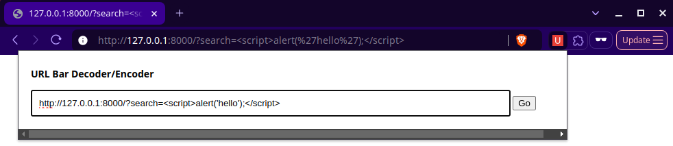

# URL Bar Decoder/Encoder
This is a simple extension for Chromium-based browsers that lets you decode and encode URL of the URL bar.

I wrote this because Chromium-based browsers encode the URL bar, for example `http://127.0.0.1:8000/?code=` into `http://127.0.0.1:8000/?code=%3Cscript%3Ealert(%27hello%27);%3C/script%3E` which is pretty hard to read and change, especially for an attacker.

It's recommended to add a keyboard shortcut from settings to open the popup easily.
